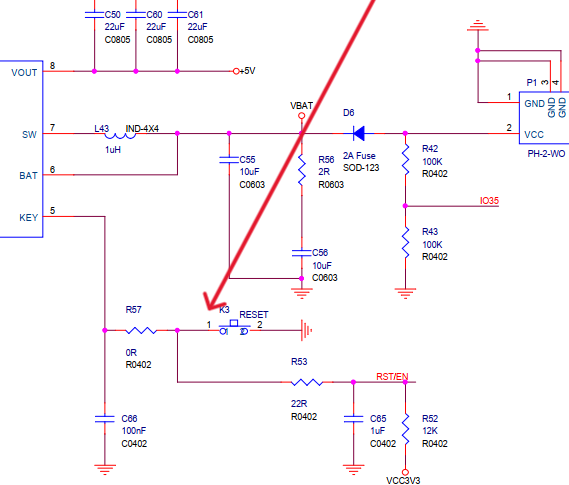

# IP5306\_ESP32 Library

The **IP5306\_ESP32** library is designed to interact with the IP5306 power management IC using I2C. This library is inferred from the original [IP5306 Arduino Library](https://github.com/Al1c3-1337/IP5306-arduino/tree/master), with some minor changes.

## Features

- Interact with the IP5306 power management IC via I2C.
- Query and configure system and charging registers.

## Changes Made

- Adjusted the library to improve compatibility with ESP32.
- Uploaded a working example sketch to demonstrate API usage.

## Tested Hardware

These APIs have been tested on the [**TTGO T-Call SIM800L**](https://lilygo.cc/products/t-call-v1-4?variant=43766872965301) version only.

## Known Issue with TTGO T-Call

The **TTGO T-Call** has a major design flaw: the **KEY** pin is connected to the ESP32-Wrover-E/B **RESET** pin. This causes the following issue:

- If the TTGO is running on battery power and the battery fully discharges or is removed while the device is running, the ESP32-Wrover-E/B **RESET** button must be pressed to restart the board.

Below is a schematic illustrating this issue:




## Installation

1. Clone or download the repository.
2. Place the `IP5306_ESP32` folder in your Arduino `libraries` folder.
3. Restart the Arduino IDE to ensure the library is recognized.

## API Reference

### Include the Library

Include the library and initialize I2C before using the APIs:

```cpp
#include <Wire.h>
#include "IP5306_ESP32.h"

void setup() {
    Wire.begin();
}
```

### API Functions

Below are the available API functions with their usage and expected output.

#### `uint8_t IP5306_GetPowerSource()`

Gets the current power source.

- **Returns**:
  - `0`: Battery
  - `1`: VIN

**Usage:**

```cpp
uint8_t powerSource = IP5306_GetPowerSource();
Serial.print("Power Source: ");
if (powerSource == 0) {
    Serial.println("Battery");
} else {
    Serial.println("VIN");
}
```

#### `uint8_t IP5306_IsBatteryFull()`

Checks if the battery is fully charged.

- **Returns**:
  - `0`: Not full
  - `1`: Full

**Usage:**

```cpp
uint8_t batteryFull = IP5306_IsBatteryFull();
Serial.print("Battery Full: ");
Serial.println(batteryFull ? "Yes" : "No");
```

#### `void IP5306_EnableBoostConverter(bool enable)`

Enables or disables the boost converter.

- **Parameters**:
  - `enable`: `true` to enable, `false` to disable.

**Usage:**

```cpp
IP5306_EnableBoostConverter(true);
Serial.println("Boost converter enabled");
```

#### `uint8_t IP5306_GetBatteryLevel()`

Gets the battery level percentage.

- **Returns**: Battery level as a percentage (0-100).

**Usage:**

```cpp
uint8_t batteryLevel = IP5306_GetBatteryLevel();
Serial.print("Battery Level: ");
Serial.print(batteryLevel);
Serial.println("%");
```

#### `void IP5306_SetChargingCurrent(uint8_t current)`

Sets the charging current for the IP5306.

- **Parameters**:
  - `current`: Charging current value (refer to the datasheet for valid values).

**Usage:**

```cpp
IP5306_SetChargingCurrent(3); // Set to a predefined current level
Serial.println("Charging current set");
```

#### `uint8_t IP5306_GetChargeState()`

Gets the current charging state.

- **Returns**:
  - `0`: Not charging
  - `1`: Charging

**Usage:**

```cpp
uint8_t chargeState = IP5306_GetChargeState();
Serial.print("Charging State: ");
Serial.println(chargeState ? "Charging" : "Not Charging");
```

## Contributing

Feel free to submit issues and pull requests to improve the library.

---

**Note:** Refer to the [IP5306 Application Note](./documental_assets/datasheet/IP5306_Application_Note.pdf) and the [IP5306 Datasheet](./documental_assets/datasheet/IP5306_datasheet.pdf) for more information about the registers and their configurations.

---

**h**

